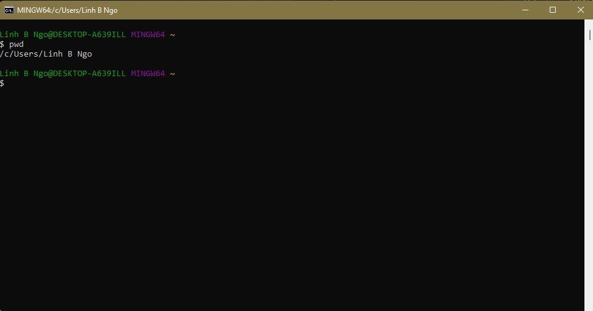
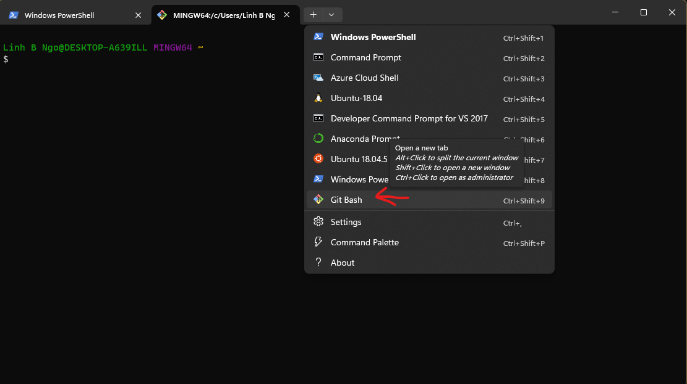
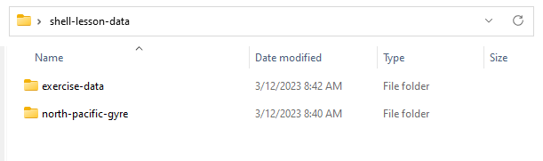
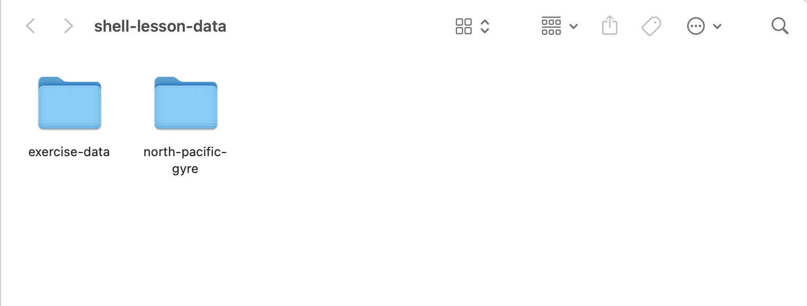

# Introduction to the Unix shell

The workshop provides an introduction to the Unix shell for researchers. It's a
condensed and edited version of [this workshop from Software
Carpentry](https://swcarpentry.github.io/shell-novice/index.html)

The shell lets you automate repetitive tasks and combine smaller tasks
into larger, more powerful workflows. Use of the shell is fundamental to a wide
range of advanced computing tasks, including high-performance computing.

Topics will include the file system, file and directory manipulation, chaining
multiple tools using pipes, and basic scripting.

## Preparation

To do this workshop, you'll need a Unix shell, and to download an example
dataset that we'll be working with. Follow the steps below to make sure you're
ready with both of these.

```{admonition} Get a Unix shell

:::::{tab-set}
::::{tab-item} Windows
Prior to workshop, Windows users should download and install
[Git for Windows](https://gitforwindows.org/). Git for Windows comes with an app called "Git Bash", which is a Unix shell. If you already have Git for Windows installed, please update it, as only more recent versions come with Git Bash.

You can launch the "Git Bash" app from the Windows Main Menu:



You can also launch Git Bash via Windows Terminal. Windows Terminal is a powerful
terminal program intended to replace the older Command Prompt and PowerShell
launchers. The terminal is available by default with Windows 11. For earlier versions,
it can be downloaded and installed via the Windows App Store. More detailed instructions
can be found at https://learn.microsoft.com/en-us/windows/terminal/install.



::::
::::{tab-item} macOS

For macOS users, the "Terminal" app provides a Unix shell, and is built-in to the operating system, so you don't need to install anything.

Open Spotlight, the macOS search tool, by clicking the magnifying glass icon in the top right corner of your screen. Start typing
"terminal" into the search box. The Terminal app will appear, and you can click on it or press `Enter` to launch it.


::::
:::::

```

```{admonition} Download example data

- Download [the workshop data](https://github.com/URCF/urcf_workshops/raw/master/data/shell-lesson-data.zip)
to your computer's Downloads folder. Make sure to leave it in the Downloads folder, as the exact location is important in the workshop.
- Unzip the file. You should see the following contents in an unzipped folder called "shell-lesson-data":

:::::{tab-set}
::::{tab-item} Windows



::::
::::{tab-item} MacOS



::::
:::::