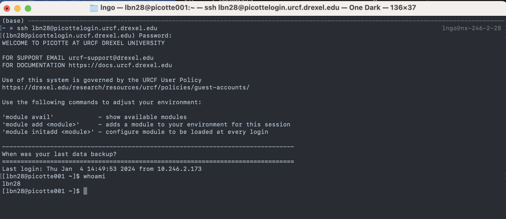

# Accessing Picotte

## Remote login with SSH

To access Picotte, we use a program called
[SSH](https://en.wikipedia.org/wiki/Secure_Shell)[^ssh], which lets you connect
your terminal to another computer (called the "remote") over the network. Once
connected, commands you type will be sent to the remote machine, run there, and
the output will be sent back to your terminal. This gives you the feeling of
having your screen and keyboard directly connected to the remote machine. SSH is
a powerful, flexible tool that's very widely used in technical computing, and
worth learning well.

To start, open your shell app (Terminal on macOS, Git Bash or WSL on Windows)
and type the following command, replacing `YOUR_PICOTTE_USERNAME` with your
actual Picotte username. This is usually the same as your Drexel
username (your email address without the `@drexel.edu`[^username]).

~~~bash
ssh YOUR_PICOTTE_USERNAME@picottelogin.urcf.drexel.edu
~~~

You'll be prompted to enter your password. **This is your Picotte password, not
your main Drexel password!** Your Picotte account is seperate from your main
Drexel account, and the passwords are independent from each other, they just use
the same username for convenience.

Once logged in, you are presented with a welcome message and the following prompt,
with `username` replaced by your actual Picotte username:

~~~bash
[username@picotte001 ~]$
~~~

`picotte001` is another name for `picottelogin`—this is telling us that we're
connected to Picotte.

Let's enter our first command! Type the command `whoami`, then press `Enter` to
send the command to Picotte. The command's output is your username.

~~~bash
whoami
~~~

:::::{tab-set}
::::{tab-item} Windows


::::
::::{tab-item} MacOS



::::
:::::

## How does SSH work?

What's actually happening when we run the SSH command? Let's imagine your username is `bn23` When you say:

```
ssh bn23@picottelogin.urcf.drexel.edu
```

We're telling SSH "I want to connect to the computer called
`picottelogin.urcf.drexel.edu`, logging in as the username `bn23`".

`picottelogin.urcf.drexel.edu` is called the **hostname** or **address** of the
remote machine. It's just a name that lets you refer to another computer on a
network. This is just like typing `google.com` into your web browser:
`google.com` is just a name you use to refer to Google's servers;
`picottelogin.urcf.drexel.edu` is a name you use to refer to Picotte.

After you're connected, when you type a command like `whoami` and press enter,
rather than running `whoami` on your local computer, SSH sends a message to the
remote machine, asking it:

> Can you please run the command `whoami` and send me the output?

The remote machine (`picottelogin.urcf.drexel.edu`) does so, and responds:

> OK, the output is: `bn23`.

SSH then takes that output and prints it for you. In this way, it feels like
you're directly connect to the remote machine because SSH is shuffling the
commands you want to run and their output over the network for you.

:::{figure} ../fig/intro_picotte/accessing/ssh.png
:alt: SSH diagram showing command and output flow
:align: center

SSH sends commands to a remote server and receives output back
:::


[^ssh]: "SSH" is short for "**S**ecure **SH**ell"
[^username]: So if my Drexel email is `bn23@drexel.edu`, my Picotte username is `bn23`.