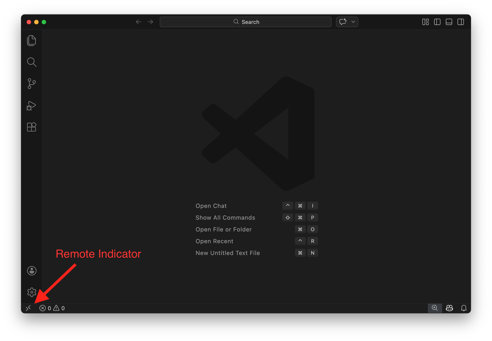
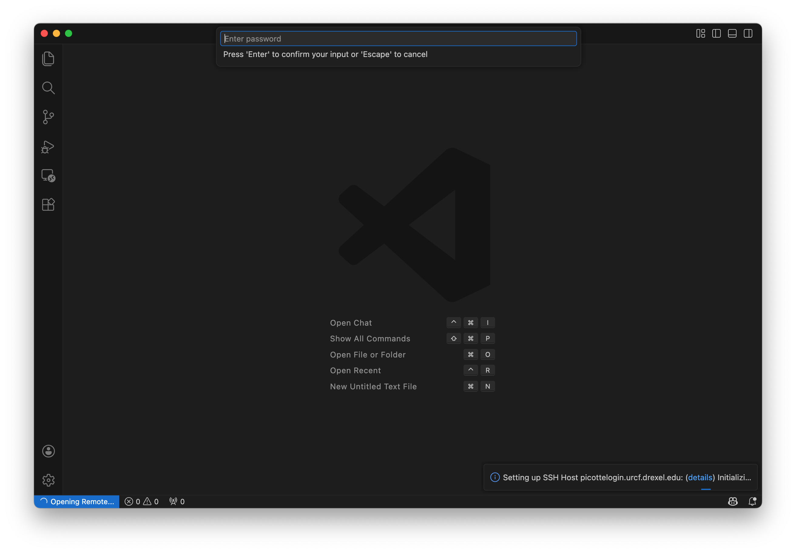
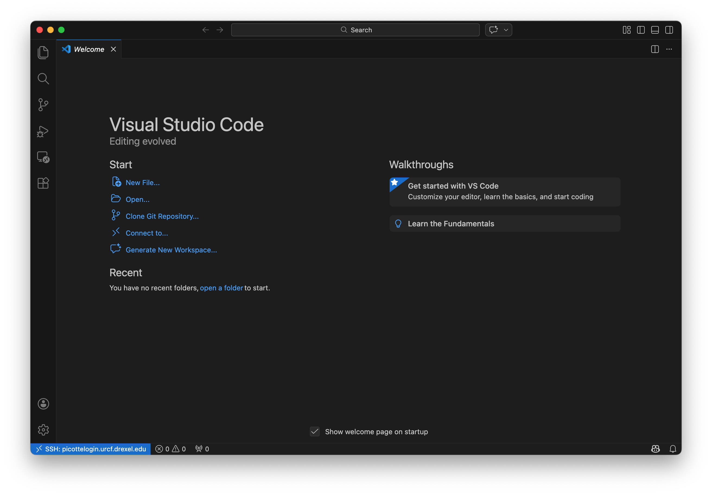
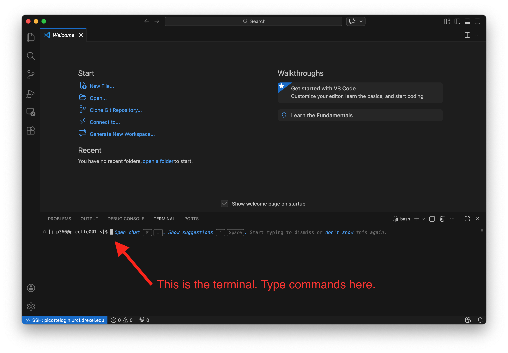

# Accessing Picotte

## Connecting with VSCode

To access Picotte, we'll use VSCode's "Remote - SSH" extension, which connects
your editor to Picotte over the network using
[SSH](https://en.wikipedia.org/wiki/Secure_Shell)[^ssh]. Once connected,
VSCode's built-in terminal, file browser, and text editor all operate directly
on Picotte — giving you a seamless way to work on the cluster.

### Connect to Picotte

1. Open VSCode.

2. Click the **Remote indicator** in the bottom-left corner of the window (it
   looks like a `><` icon).

   

3. Select **"Connect to Host..."** from the menu that appears.

4. A text box will appear at the top of the window, prompting you to "Select
   configured SSH host or enter user@host". In this box, type:

   ```
   YOUR_PICOTTE_USERNAME@picottelogin.urcf.drexel.edu
   ```

   replacing `YOUR_PICOTTE_USERNAME` with your actual Picotte username. This is
   usually the same as your Drexel username (your email address without the
   `@drexel.edu`[^username]).

   

5. If prompted to select the platform of the remote host, choose **Linux**.

6. Enter your password when prompted. **This is your Picotte password, not
   your main Drexel password!** Your Picotte account is separate from your main
   Drexel account, and the passwords are independent from each other — they just
   use the same username for convenience.

   

7. Wait for VSCode to finish setting up. The remote indicator in the bottom-left
   will change to show `SSH: picottelogin.urcf.drexel.edu` when you're
   connected.

   

### Your first command

Now that you're connected, let's open a terminal on Picotte. Press
<kbd>Ctrl</kbd>+<kbd>Shift</kbd>+<kbd>\`</kbd> (that is: hold down
<kbd>Ctrl</kbd> and <kbd>Shift</kbd>, then press the key with the <code>`</code>
character, usually in the upper-left of your keyboard) to open VSCode's
integrated terminal. You can also open it from the menu: **Terminal → New
Terminal**.

This terminal is running on Picotte, not on your local computer. You should see
a prompt like this, with `username` replaced by your actual Picotte username:

~~~bash
[username@picotte001 ~]$
~~~

`picotte001` is another name for `picottelogin` — this is telling us that we're
connected to Picotte.




Let's enter our first command! Type the command `whoami`, then press `Enter` to
send the command to Picotte. The command's output is your username.

~~~bash
whoami
~~~


```{admonition} Save Picotte as a configured host (optional)
:class: dropdown

You can save Picotte's connection details so it appears in your host list for
quick access in the future.

1. Press `Ctrl+Shift+P` (Windows/Linux) or `Cmd+Shift+P` (macOS) to open the
   Command Palette.
2. Type **"Remote-SSH: Open SSH Configuration File..."** and select it.
3. Choose the default config file (usually `/Users/YOUR_USERNAME/.ssh/config` on macOS/Linux or
   `C:\Users\YOUR_USERNAME\.ssh\config` on Windows).
4. Add the following block, replacing `YOUR_PICOTTE_USERNAME` with your actual
   username:

   ~~~
   Host picotte
       HostName picottelogin.urcf.drexel.edu
       User YOUR_PICOTTE_USERNAME
   ~~~

5. Save the file (<kbd>Ctrl</kbd>+<kbd>S</kbd> on Windows/Linux or <kbd>Cmd</kbd>+<kbd>S</kbd> on macOS).

Now, when you click the remote indicator and choose "Connect to Host...",
**picotte** will appear in the list — just click it to connect.
```

## How does SSH work?

What's actually happening when VSCode connects? Let's imagine your username is `bn23`. When you tell VSCode to connect to:

```
bn23@picottelogin.urcf.drexel.edu
```

VSCode connects to the computer called `picottelogin.urcf.drexel.edu`, logging
in as the username `bn23`.

`picottelogin.urcf.drexel.edu` is called the **hostname** or **address** of the
remote machine. It's just a name that lets you refer to another computer on a
network. This is just like typing `google.com` into your web browser:
`google.com` is just a name you use to refer to Google's servers;
`picottelogin.urcf.drexel.edu` is a name you use to refer to Picotte.

After you're connected, when you type a command like `whoami` and press enter in
the integrated terminal, rather than running `whoami` on your local computer,
VSCode sends the command to the remote machine, which runs it and sends back the
output. In this way, it feels like you're directly connected to the remote
machine because the commands you want to run and their output are being shuffled
over the network for you.

:::{figure} ../fig/intro_picotte/accessing/ssh.png
:alt: SSH diagram showing command and output flow
:align: center

VSCode sends commands to a remote server and receives output back
:::


[^ssh]: "SSH" is short for "**S**ecure **SH**ell"
[^username]: So if my Drexel email is `bn23@drexel.edu`, my Picotte username is `bn23`.
