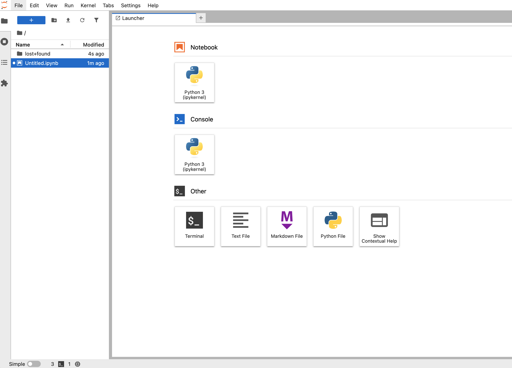
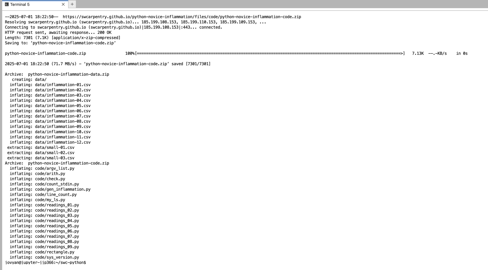
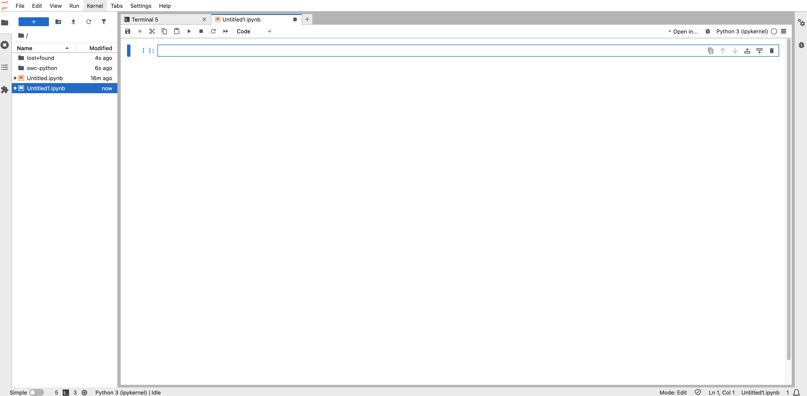

# Introduction to Python Programming

This workshop introduces Python for those that have little to no programming
experience, and has two parts:

1. A quick introduction to Python and the basics of processing and visualizing
   data.
2. A more in-depth view into programming concepts in Python, including loops,
  conditions, functions, and debugging.

The workshop uses material from [Software Carpentry's *Programming with Python*
lesson](https://swcarpentry.github.io/python-novice-inflammation/).


## Preparation

We'll be using a hosted JupyterHub service for this workshop. **Be sure to do
the "Before the workshop" steps before and confirm they work for you prior to
the start of the workshop.**

```{admonition} Before the workshop
:class: note

1. Go to https://drexeljupyter.eastus.cloudapp.azure.com/
2. Click the "Sign in with Globus" button.
3. Under "Use your existing organizational login" choose "Drexel University" from the list of institutions and click "Continue".
4. Sign in using Drexel Connect.
5. You'll now be presented with a "Server Options" page. Choose "Jupyter Datascience" and click "Start"
6. Wait for the loading screen to finish, then you should see the Jupyter notebook interface, which looks like this:



You're now ready for the workshop. There are some additional preparation steps, but we'll do them together at the beginning of the workshop.
```

```{admonition} At the start of the workshop.
:class: note

1. From the Jupyter notebook interface, click the "Terminal" button in the "Other" section to open a new shell.
2. In the shell, copy and paste the following lines to download the data we'll be using:

~~~bash
cd
wget https://swcarpentry.github.io/python-novice-inflammation/data/python-novice-inflammation-data.zip
wget https://swcarpentry.github.io/python-novice-inflammation/files/code/python-novice-inflammation-code.zip
unzip python-novice-inflammation-data.zip
unzip python-novice-inflammation-code.zip
~~~

Your screen should look like this:



3. To confirm the download worked, run `ls`. You should see `code` and `data` directories:

~~~
jovyan@jupyter-jjp366:~/swc-python$ ls
code  data  python-novice-inflammation-code.zip  python-novice-inflammation-data.zip
~~~

4. Click the "+" button next to the tabs at the top of the screen to open the Launcher again.
5. Click on "Python 3 (ipykernel)" in the "Notebook" section. Your screen should look like this:



The textbox you see is called a "cell" You can type Python code and press `Shift`+`Enter` to run it and create a new cell. You're now ready to start the workshop!

```