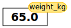

---
jupytext:
  text_representation:
    extension: .md
    format_name: myst
kernelspec:
  display_name: Python 3
  language: python
  name: python3
---

# Python Fundamentals

```{admonition} Objectives
- Use Python as a calculator.
- Assign values to variables.
- Use variables in expressions.
- Call built-in functions like `print()`.
```

```{admonition} Questions
- What basic data types can I work with in Python?
- How can I create a new variable in Python?
- How do I use a function?
- Can I change the value associated with a variable after I create it?
```

## Using Python as a Calculator

At its simplest, Python can be used as a calculator. Throughout this workshop, we're going to be working with traffic data from an automated sensor that measures how many cars passed in a given hour.

Let's say we're interested in looking at morning rush hour traffic, which we take to be the 7am and 8am measurements. On the day in question, there were 500 cars at 7am, and 600 cars at 8am. What's the total? We can use Python to do this addition.

```{code-cell} python
500 + 600
```

or any other arithmetic, for example, subtracting to get the difference:

```{code-cell} python
600 - 500
```

This fine, but we can do all this with a calculator app. To start making use of the power of a full-featured programming language like Python, we can assign our data to *variables*.

## Variables

We *assign* a value to a variable using the equals sign `=`. For example, we can track the number of cars at different times:

```{code-cell} python
cars_at_7am = 500
cars_at_8am = 600
```

From now on, whenever we use `cars_at_7am`, Python will substitute the value we assigned to it. You can think of it like this: **a variable is a name for a value**.

```{tip}
In Python, variable names:

- can include letters, digits, and underscores
- cannot start with a digit
- are case sensitive.

This means that, for example:

- `cars_7am` is a valid variable name, whereas `7am_cars` is not
- `cars` and `Cars` are different variables
```

## Types of data

Python knows various types of data. Three common ones are:

- integer numbers
- floating point (a.k.a. decimal) numbers, and
- text. In programming textual data is called "strings".

In the example above, variable `cars_at_7am` has a integer value of `500`. If we want to represent a decimal number, we can use a floating point:

```{code-cell} python
speed_mph = 54.3
```

To create a string, we add single or double quotes around some text. We might want a label for this group of data, for example:

```{code-cell} python
time_of_day = 'morning'
```

## Using Variables in Python

Once we have data stored with variable names, we can make use of it in calculations. Now we can do the same calculation of the total rush hour traffic, but using variables:

```{code-cell} python
cars_at_7am + cars_at_8am
```

This makes it more clear what we're doing.

We can also "add" strings together to create a new string. For example, we might want to make our label more descriptive:

```{code-cell} python
time_of_day + ' rush hour'
```

We can also store the results of calculations in variables:

```{code-cell} python
increase_in_cars = cars_at_8am - cars_at_7am
```

## Built-in Python functions

You might notice that when we assign a value to a variable, the value is not printed to the screen. To display the value of a variable, we can use the `print` function:

```{code-cell} python
print(increase_in_cars)
```

When we want to use a function, referred to as *calling* the function,
we type its name, followed by parentheses. The parentheses are important: if you
leave them off, the function doesn't actually run! Often you will include
values or variables inside the parentheses for the function to use. These are
called *arguments*, and including them is called *passing arguments* to a
function. In the case of `print`, we pass the `increase_in_cars` variable as an
argument to the `print` function, and `print` displays the value `increase_in_cars`.

We can display multiple things at once by passing multiple arguments:

```{code-cell} python
print("Cars at 7 AM:", cars_at_7am)
```

We can also call a function inside of another function call. For example, Python has a built-in function called `type` that tells you a value's data type:

```{code-cell} python
print(type(400))
print(type("morning"))
```

Moreover, we can do arithmetic with variables right inside the `print` function:

```{code-cell} python
print('Total rush hour traffic:', cars_at_7am + cars_at_8am)
```

~~~{admonition} Variables as Sticky Notes
:class: tip

A variable in Python is analogous to a sticky note with a name written on it: assigning a value to a variable is like putting that sticky note on a particular value.

<!-- TODO re-create these images with the traffic data rather than weight -->
<!--  -->

Using this analogy, we can investigate how assigning a value to one variable does **not** change values of other, seemingly related, variables. For example, let's store the total rush hour traffic in its own variable:

```{code-cell} python
total_rush_hour = cars_at_7am + cars_at_8am
print('Cars at 7 AM:', cars_at_7am, 'Total rush hour:', total_rush_hour)
```

Everything in a line of code following the '#' symbol is a comment that is ignored by Python. Comments allow programmers to leave explanatory notes for other programmers or their future selves.

<!--  -->

Similar to above, the expression `cars_at_7am + cars_at_8am` is evaluated to `1100`, and then this value is assigned to the variable `total_rush_hour` (i.e. the sticky note `total_rush_hour` is placed on `1100`). At this point, each variable is "stuck" to completely distinct and unrelated values.

Let's now change `cars_at_7am`:

```{code-cell} python
cars_at_7am = 600
print('Cars at 7 AM is now:', cars_at_7am, 'and total rush hour is still:', total_rush_hour)
```

<!--  -->

Since `total_rush_hour` doesn't "remember" where its value comes from, it is not updated when we change `cars_at_7am`.

~~~

~~~{admonition} Challenge: Check Your Understanding
:class: note

What values do the variables `mass` and `age` have after each of the following statements?
Test your answer by executing the lines.

```python
mass = 47.5
age = 122
mass = mass * 2.0
age = age - 20
```

:::{dropdown} Solution
`mass` holds a value of 47.5, `age` does not exist
`mass` still holds a value of 47.5, `age` holds a value of 122
`mass` now has a value of 95.0, `age`'s value is still 122
`mass` still has a value of 95.0, `age` now holds 102
:::

~~~

~~~{admonition} Challenge: Sorting Out References
:class: note

Python allows you to assign multiple values to multiple variables in one line by separating
the variables and values with commas. What does the following program print out?

```python
first, second = 'Grace', 'Hopper'
third, fourth = second, first
print(third, fourth)
```

:::{dropdown} Solution

Hopper Grace

:::

~~~

~~~{admonition} Challenge: Seeing Data Types
:class: note

What are the data types of the following variables?

```python
planet = 'Earth'
apples = 5
distance = 10.5
```

:::{dropdown} Solution

```python
print(type(planet))
print(type(apples))
print(type(distance))
```

```output
<class 'str'>
<class 'int'>
<class 'float'>
```

:::

~~~

```{admonition} Keypoints
- Basic data types in Python include integers, strings, and floating-point numbers.
- Use `variable = value` to assign a value to a variable in order to record it in memory.
- Variables are created on demand whenever a value is assigned to them.
- Use `print(something)` to display the value of `something`.
- Use `# some kind of explanation` to add comments to programs.
- Built-in functions are always available to use.
```
