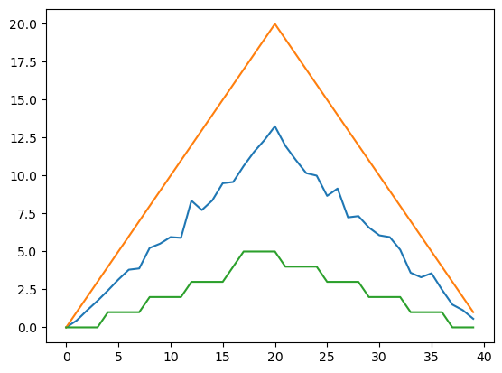

# Visualizing Tabular Data

:::{admonition} Objectives
- Plot simple graphs from data.
- Plot multiple graphs in a single figure.
:::

:::{admonition} Questions
- How can I visualize tabular data in Python?
- How can I group several plots together?
:::

## Visualizing data

The mathematician Richard Hamming once said, "The purpose of computing is insight, not numbers,"
and the best way to develop insight is often to visualize data.  Visualization deserves an entire
lecture of its own, but we can explore a few features of Python's `matplotlib` library here.  While
there is no official plotting library, `matplotlib` is the *de facto* standard.  First, we will
import the `pyplot` module from `matplotlib` and use two of its functions to create and display a
**heat map** of our data:

:::{admonition} Episode Prerequisites
If you are continuing in the same notebook from the previous episode, you already
have a `data` variable and have imported `numpy`.  If you are starting a new
notebook at this point, you need the following two lines:

```python
import numpy
data = numpy.loadtxt(fname='data/inflammation-01.csv', delimiter=',')
```
:::


```python
import matplotlib.pyplot
image = matplotlib.pyplot.imshow(data)
matplotlib.pyplot.show()
```


Each row in the heat map corresponds to a patient in the clinical trial dataset, and each column
corresponds to a day in the dataset.  Blue pixels in this heat map represent low values, while
yellow pixels represent high values.  As we can see, the general number of inflammation flare-ups
for the patients rises and falls over a 40-day period.

So far so good as this is in line with our knowledge of the clinical trial and Dr. Maverick's
claims:

- the patients take their medication once their inflammation flare-ups begin
- it takes around 3 weeks for the medication to take effect and begin reducing flare-ups
- and flare-ups appear to drop to zero by the end of the clinical trial.

Now let's take a look at the average inflammation over time:

```python
ave_inflammation = numpy.mean(data, axis=0)
matplotlib.pyplot.plot(ave_inflammation)
matplotlib.pyplot.show()
```


Here, we have put the average inflammation per day across all patients in the variable
`ave_inflammation`, then asked `matplotlib.pyplot` to create and display a line graph of those
values.  The result is a reasonably linear rise and fall, in line with Dr. Maverick's claim that
the medication takes 3 weeks to take effect.  But a good data scientist doesn't just consider the
average of a dataset, so let's have a look at two other statistics:

```python
matplotlib.pyplot.plot(numpy.amax(data, axis=0))
matplotlib.pyplot.show()
```


```python
matplotlib.pyplot.plot(numpy.amin(data, axis=0))
matplotlib.pyplot.show()
```


The maximum value rises and falls linearly, while the minimum seems to be a step function.
Neither trend seems particularly likely, so either there's a mistake in our calculations or
something is wrong with our data. This insight would have been difficult to reach by examining
the numbers themselves without visualization tools.

If we want, we can even look at all three graphs on the same plot:

```python
matplotlib.pyplot.plot(numpy.mean(data, axis=0))
matplotlib.pyplot.plot(numpy.amax(data, axis=0))
matplotlib.pyplot.plot(numpy.amin(data, axis=0))
matplotlib.pyplot.show()
```



```{admonition} Importing libraries with shortcuts
:class: tip

In this lesson we use the `import matplotlib.pyplot`
**syntax** to import the `pyplot` module of `matplotlib`. However, shortcuts such as
`import matplotlib.pyplot as plt` are frequently used.
Importing `pyplot` this way means that after the initial import, rather than writing
`matplotlib.pyplot.plot(...)`, you can now write `plt.plot(...)`.
Another common convention is to use the shortcut `import numpy as np` when importing the
NumPy library. We then can write `np.loadtxt(...)` instead of `numpy.loadtxt(...)`,
for example.

Some people prefer these shortcuts as it is quicker to type and results in shorter
lines of code - especially for libraries with long names! You will frequently see
Python code online using a `pyplot` function with `plt`, or a NumPy function with
`np`, and it's because they've used this shortcut. It makes no difference which
approach you choose to take, but you must be consistent as if you use
`import matplotlib.pyplot as plt` then `matplotlib.pyplot.plot(...)` will not work, and
you must use `plt.plot(...)` instead. Because of this, when working with other people it
is important you agree on how libraries are imported.

```


~~~{admonition} Challenge: Make Your Own Plot
:class: note

Create a plot showing the standard deviation (`numpy.std`)
of the inflammation data for each day across all patients.

:::{dropdown} Solution
```python
matplotlib.pyplot.plot(numpy.std(data, axis=0))
matplotlib.pyplot.show()
```
:::
~~~


```{admonition} Keypoints
- Use the `pyplot` module from the `matplotlib` library for creating simple visualizations.
```


