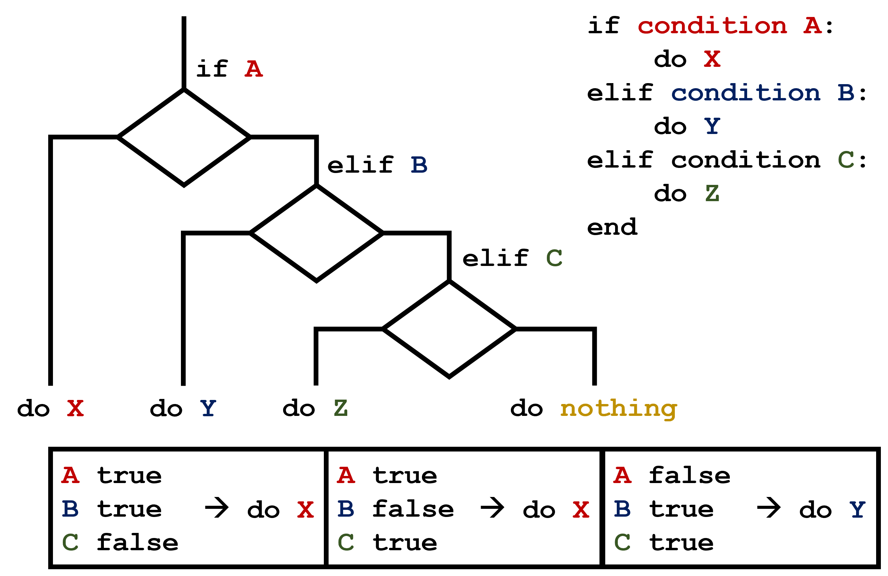

---
jupytext:
  text_representation:
    extension: .md
    format_name: myst
kernelspec:
  display_name: Python 3
  language: python
  name: python3
---

# Making Choices

Previously, we learned how to visualize traffic data, and used plots to distinguish between weekdays and weekends. How can we use Python to automatically recognize different features we saw, and take a different action for each? In this lesson, we'll learn how to write code that runs only when certain conditions are true, and use this to make a clearer plot of our traffic data.

## Conditionals

We can ask Python to take different actions, depending on a condition, with an `if` statement:

```{code-cell} python
num = 50
if num > 100:
    print('greater')
else:
    print('lesser')
print('done')
```

The second line of this code uses the keyword `if` to tell Python that we want to make a choice. If the test that follows the  `if` statement is true, the body of the `if` (i.e., the set of lines indented underneath it) is executed, and "greater" is printed. If the test is false, the body of the `else` is executed instead, and "lesser" is printed. Only one or the other is ever executed before continuing on with program execution to print "done":


Conditional statements don't have to include an `else`. If there isn't one, Python simply does nothing if the test is false:

```{code-cell} python
num = 50
print('before conditional...')
if num > 100:
    print(num, 'is greater than 100')
print('...after conditional')
```

We can also chain several tests together using `elif`, which is short for "else if". The following Python code uses `elif` to categorize traffic levels:

```{code-cell} python
traffic_count = 3500

if traffic_count > 5000:
    print(traffic_count, 'is very heavy traffic')
elif traffic_count > 3000:
    print(traffic_count, 'is heavy traffic')
else:
    print(traffic_count, 'is normal traffic')
```

Note that to test for equality we use a double equals sign `==` rather than a single equals sign `=` which is used to assign values.

:::{admonition} Comparing in Python

Along with the `>` and `==` operators we have already used for comparing values in our conditionals, there are a few more options to know about:

- `>`: greater than
- `<`: less than
- `==`: equal to
- `!=`: does not equal
- `>=`: greater than or equal to
- `<=`: less than or equal to

:::

We can also combine tests using `and` and `or`. `and` is only true if both parts are true:

```python
if 50 > 30 and 20 >= 15:
    print('both parts are true')
else:
    print('at least one part is false')
```

```output
both parts are true
```

while `or` is true if at least one part is true:

```python
if 20 > 50 or 20 >= 15:
    print('at least one test is true')
```

```output
at least one test is true
```

## Using conditionals to make a clearer plot

Now let's try to use this to make a clearer plot of our traffic data. We're going to use conditionals to show weekends and weekdays in different colors.

First, we need a way for Python to determine whether a day is a weekday or a weekend using an `if` statement. Let's try looking at the 7am traffic reading for each day:

```{code-cell} python
import numpy
import matplotlib.pyplot as plt

traffic_data = numpy.loadtxt('traffic_data.txt', delimiter=',')

for i in range(len(traffic_data)):
    print('Day', i + 1, '7am traffic:', traffic_data[i, 7])
```

Ah, from this we can see that on weekdays, there's always more than 5000 cars passing from 7 to 8am, and on weekends always less. Let's try using that as our conditional.

To make the plot clearer, we can use the `color` parameter in `plt.plot()` to specify what color each line should be. We'll use a loop with an `if` statement to check each day's 7am traffic and plot it in a different color depending on whether it's a weekday or weekend:

```{code-cell} python
for i in range(len(traffic_data)):
    if traffic_data[i, 7] > 5000:
        # Weekday - has heavy morning traffic at 7am
        plt.plot(traffic_data[i], color='blue')
    else:
        # Weekend - lighter morning traffic
        plt.plot(traffic_data[i], color='orange')
```

Now the plot is more clear, and we can easily see the difference between weekday and weekend traffic patterns! This even gets us some additional insights—for example, it's easy to see that the weekends have less traffic overall than the weekdays, in addition to the peak time difference.

~~~{admonition} Challenge: How Many Paths?

Consider this code:

```python
traffic_count = 4500

if traffic_count > 5000:
    print('A')
elif traffic_count == 5000:
    print('B')
elif traffic_count < 5000:
    print('C')
```

Which of the following would be printed if you were to run this code? Why did you pick this answer?

1. A
2. B
3. C
4. B and C

:::{dropdown} Solution

C gets printed because the first two conditions, `traffic_count > 5000` and `traffic_count == 5000`, are not true, but `traffic_count < 5000` is true. In this case only one of these conditions can be true at a time, but in other scenarios multiple `elif` conditions could be met. In these scenarios only the action associated with the first true `elif` condition will occur, starting from the top of the conditional section.



This contrasts with the case of multiple `if` statements, where every action can occur as long as their condition is met.


:::

~~~

~~~{admonition} Challenge: What Is Truth?

`True` and `False` booleans are not the only values in Python that are true and false. In fact, *any* value can be used in an `if` or `elif`. After reading and running the code below, explain what the rule is for which values are considered true and which are considered false.

```python
if '':
    print('empty string is true')
if 'traffic':
    print('traffic is true')
if []:
    print('empty list is true')
if [100, 200, 300]:
    print('non-empty list is true')
if 0:
    print('zero is true')
if 1:
    print('one is true')
```

:::{dropdown} Solution
The rule is that any non-zero number is true, any empty collection (like an empty string or list) is false, and any non-empty collection is true.
:::

~~~

~~~{admonition} Challenge: That's Not Not What I Meant

Sometimes it is useful to check whether some condition is not true. The Boolean operator `not` can do this explicitly. After reading and running the code below, write some `if` statements that use `not` to test the rule that you formulated in the previous challenge.

:::{dropdown} Solution
```python
if not '':
    print('empty string is not true')
if not 'traffic':
    print('traffic is not true')
if not not True:
    print('not not True is true')
```
:::

~~~

~~~{admonition} Challenge: Counting Heavy Traffic Hours

1. Write a loop that counts the number of hours in a day where traffic exceeds 5000 vehicles.
2. Test it on a few different days from the traffic dataset.
3. Once you are done, compare your solution to your neighbor's. Did you make the same decisions about how to handle the threshold?

*Hint*: You can check if a value is greater than a threshold using `>`. For example:

```python
if traffic_count > 5000:
    print('Heavy traffic')
```

:::{dropdown} Solution
```python
import numpy
traffic_data = numpy.loadtxt('traffic_data.txt', delimiter=',')

# Count heavy traffic hours for the first day
day_0 = traffic_data[0]
heavy_count = 0
for count in day_0:
    if count > 5000:
        heavy_count += 1

print('Number of hours with heavy traffic:', heavy_count)
```
:::

~~~

~~~{admonition} Challenge: Identifying Rush Hours

Write code that identifies and prints the hours (0-23) when traffic exceeds 5000 vehicles for a given day. Use a loop to check each hour and an `if` statement to determine if it's a rush hour.

:::{dropdown} Solution
```python
import numpy
traffic_data = numpy.loadtxt('traffic_data.txt', delimiter=',')

# Find rush hours for the first day
day_0 = traffic_data[0]
rush_hours = []
for hour in range(len(day_0)):
    if day_0[hour] > 5000:
        rush_hours.append(hour)

print('Rush hours (0-23):', rush_hours)
```
:::

~~~

:::{admonition} Keypoints

- Use `if condition` to start a conditional statement, `elif condition` to provide additional tests, and `else` to provide a default.
- The bodies of the branches of conditional statements must be indented.
- Use `==` to test for equality.
- `X and Y` is only true if both `X` and `Y` are true.
- `X or Y` is true if either `X` or `Y`, or both, are true.
- Zero, the empty string, and the empty list are considered false; all other numbers, strings, and lists are considered true.
- `True` and `False` represent truth values.
- Combining loops with conditionals allows us to analyze patterns and make decisions based on data.

:::
