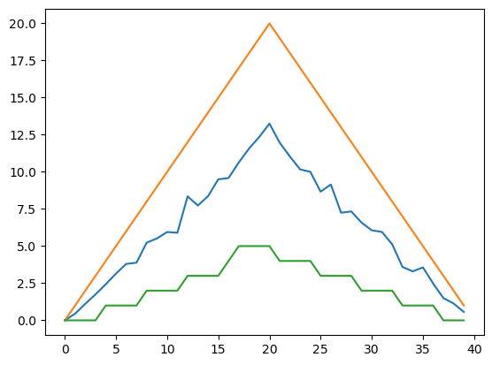
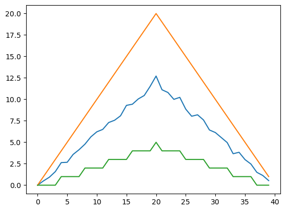
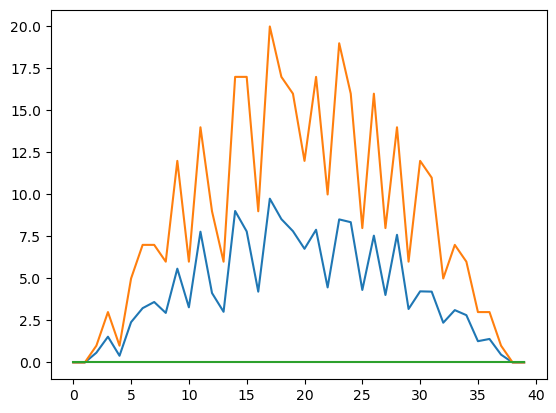

# Analyzing Data from Multiple Files

:::{admonition} Objectives

- Use a library function to get a list of filenames that match a wildcard pattern.
- Write a `for` loop to process multiple files.

:::

:::{admonition} Questions

- How can I do the same operations on many different files?

:::

As a final piece to processing our inflammation data, we need a way to get a list of all the files
in our `data` directory whose names start with `inflammation-` and end with `.csv`.
The following library will help us to achieve this:

```python
import glob
```

The `glob` library contains a function, also called `glob`, that finds files and
directories whose names match a pattern. We provide those patterns as strings:
the character `*` matches zero or more of any character. We can use this to get
the names of all the CSV files in the `data`` directory:

```python
print(glob.glob('data/inflammation*.csv'))
```

```output
['inflammation-05.csv', 'inflammation-11.csv', 'inflammation-12.csv', 'inflammation-08.csv',
'inflammation-03.csv', 'inflammation-06.csv', 'inflammation-09.csv', 'inflammation-07.csv',
'inflammation-10.csv', 'inflammation-02.csv', 'inflammation-04.csv', 'inflammation-01.csv']
```

As this output shows, `glob.glob`'s result is a list of paths in arbitrary
order. Let's just look at the first three datasets. So we need to sort the glob
output, and then take the first three:

```python
filenames = sorted(glob.glob('data/inflammation*.csv'))
filenames = filenames[0:3]
```

Now that we have our list of files to analyze, let's use matplotlib to make a
plot of the minimum, mean, and maximum inflammation on each day during the
trial:

```python
for filename in filenames:
    print(filename)

    data = numpy.loadtxt(filename, delimiter=",")

    matplotlib.pyplot.plot(numpy.mean(data, axis=0))
    matplotlib.pyplot.plot(numpy.max(data, axis=0))
    matplotlib.pyplot.plot(numpy.min(data, axis=0))
    matplotlib.pyplot.show()
```

```output
inflammation-01.csv
```



```output
inflammation-02.csv
```



```output
inflammation-03.csv
```



The plots generated for the second clinical trial file look very similar to the
plots for the first file: their average plots show similar "noisy" rises and
falls; their maxima plots show exactly the same linear rise and fall; and their
minima plots show similar staircase structures.

The third dataset shows much noisier average and maxima plots that are far less
suspicious than the first two datasets, however the minima plot shows that the
third dataset minima is consistently zero across every day of the trial. If we
produce a heat map for the third data file we see the following:

```python
data = numpy.loadtxt("data/inflammation-03.csv", delimiter=",")
matplotlib.pyplot.imshow(data)
```


We can see that there are zero values sporadically distributed across all
patients and days of the clinical trial, suggesting that there were potential
issues with data collection throughout the trial. In addition, we can see that
the last patient in the study didn't have any inflammation flare-ups at all
throughout the trial, suggesting that they may not even suffer from arthritis!

~~~{admonition} Challenge: Plotting Differences
:class: note

Change the code above to plot the average, minimum, and maximum for all the inflammation datasets, not just the first three.

Do you notice anything else suspicious about the data?

:::{dropdown} Solution

Simply remove the line:

```python
filenames = filenames[0:3]
```

and the code will plot all the datasets.

Notice that `inflammation-08.csv` and `inflammation-11.csv` have the same suspicious features as `inflammation-03.csv`: very noisy, with minima that are consistently zero across every day of the trial.

:::

~~~

~~~{admonition} Challenge: Plotting Differences
:class: note

Plot the difference between the average inflammations reported in the first and second datasets
(stored in `inflammation-01.csv` and `inflammation-02.csv`, correspondingly),
i.e., the difference between the leftmost plots of the first two figures.

*Hint*: You can get the difference between two NumPy arrays using the `-` operator (e.g. `data1 - data2`)

:::{dropdown} Solution

```python
import glob
import numpy
import matplotlib.pyplot

data1 = numpy.loadtxt("data/inflammation-01.csv", delimiter=',')
data2 = numpy.loadtxt("data/inflammation-02.csv", delimiter=',')

matplotlib.pyplot.plot(numpy.mean(data1, axis=0) - numpy.mean(data2, axis=0))
matplotlib.pyplot.show()
```

:::

~~~

~~~{admonition} Challenge: Finding suspicious datasets
:class: note

Change the code you wrote for the previous challenge to compare the daily averages for two of the datasets with suspicious minima plots (`inflammation-03.csv`, `inflammation-08.csv`, and `inflammation-11.csv`) in our earlier investigation.

:::{dropdown} Solution

```python
import glob
import numpy
import matplotlib.pyplot

data1 = numpy.loadtxt("data/inflammation-03.csv", delimiter=',')
data2 = numpy.loadtxt("data/inflammation-08.csv", delimiter=',')

matplotlib.pyplot.plot(numpy.mean(data1, axis=0) - numpy.mean(data2, axis=0))
matplotlib.pyplot.show()
```

Notice that the result is a flat line at zero: the averages for these datasets are exactly the same on each day of the trial, meaning the datasets are identical!

:::

~~~

After spending some time investigating the heat map and plots, as well as doing
the above exercises to plot differences between datasets, we gain some insight
into the twelve clinical trial datasets.

The datasets appear to fall into two categories:

- seemingly "ideal" datasets that agree excellently with Dr. Maverick's claims,
  but display suspicious maxima and minima (such as `inflammation-01.csv` and `inflammation-02.csv`)
- "noisy" datasets that somewhat agree with Dr. Maverick's claims, but show concerning
  data collection issues such as sporadic missing values and even an unsuitable candidate
  making it into the clinical trial (such as `inflammation-03.csv`).

In fact, it appears that all three of the "noisy" datasets (`inflammation-03.csv`,
`inflammation-08.csv`, and `inflammation-11.csv`) are identical down to the last value.
Armed with this information, we confront Dr. Maverick about the suspicious data and
duplicated files.

Dr. Maverick has admitted to fabricating the clinical data for their drug trial. They did this after discovering that the initial trial had several issues, including unreliable data recording and poor participant selection. In order to prove the efficacy of their drug, they created fake data. When asked for additional data, they attempted to generate more fake datasets, and also included the original poor-quality dataset several times in order to make the trials seem more realistic.

Congratulations! We've investigated the inflammation data and proven that the datasets have been
synthetically generated.

But it would be a shame to throw away the synthetic datasets that have taught us so much
already, so we'll forgive the imaginary Dr. Maverick and continue to use the data to learn
how to program.


:::{admonition} Keypoints

- Use `glob.glob(pattern)` to create a list of files whose names match a pattern.
- Use `*` in a pattern to match zero or more characters, and `?` to match any single character.

:::


